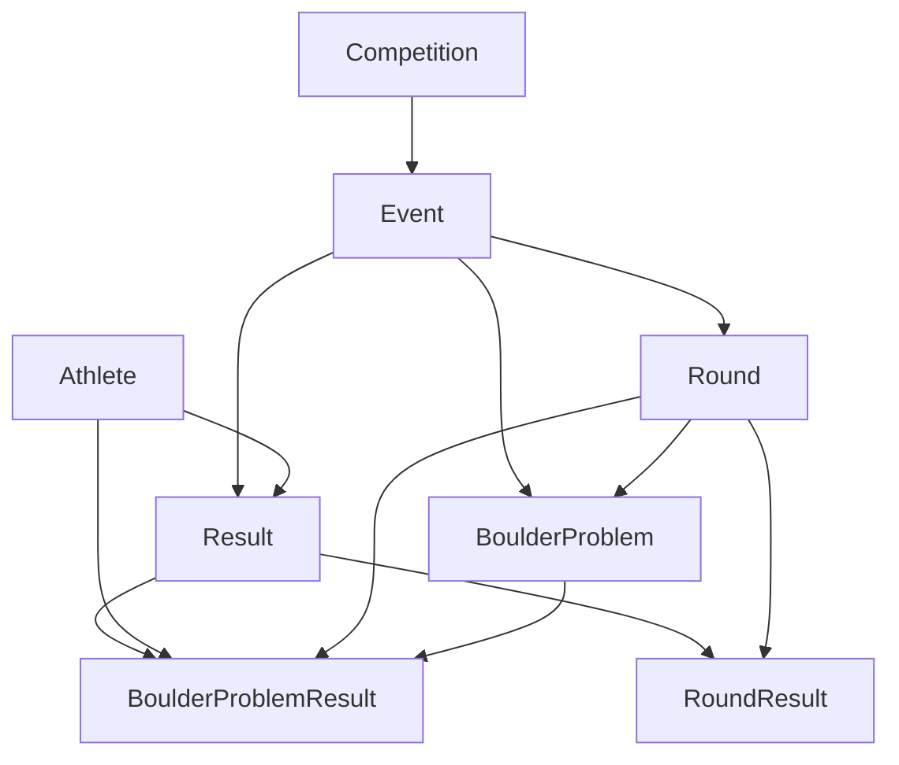

# Data Model

This document describes the current normalized data model for the bouldering proof-of-concept.

The model is intentionally small. It proves that cached first-party IFSC JSON fixtures can be parsed and normalized into records that preserve source traceability and support bouldering-specific analysis.

## Current Scope

In scope:

- IFSC first-party JSON fixtures from `ifsc.results.info`.
- Bouldering event result fixtures.
- Men and Women bouldering categories.
- Event-level rankings.
- Round-level rankings and scores.
- Shared boulder/problem records.
- Athlete-level boulder/problem results.

Out of scope:

- Lead.
- Speed.
- Database persistence.
- Frontend/UI reporting.
- Automated crawling or bulk discovery.
- Prediction or ML features.

## Relationship Overview

## Record Roles

### Competition

Represents the IFSC competition/event container, such as `IFSC World Cup Innsbruck 2025`.

Current source identity:

- `sourceCompetitionId`: currently the IFSC event ID.
- `sourceUrl`: event metadata API URL.

### Event

Represents one discipline/category result view within a competition, such as `BOULDER Men` or `BOULDER Women`.

Current source identity:

- `sourceEventId`: IFSC event ID.
- `sourceCompetitionId`: currently the IFSC event ID.
- `sourceUrl`: event result API URL.

### Round

Represents a category round, such as Qualification, Semi-final, or Final.

Current source identity:

- `sourceCategoryRoundId`: IFSC category round ID.
- `sourceUrl`: category round result URL when available from source metadata.

### Athlete

Represents a climber in the result fixture.

Current source identity:

- `sourceAthleteId`: IFSC athlete ID.
- `sourceUrl`: event result API URL.

### Result

Represents an athlete's event-level result within one Event.

Examples:

- Final rank.
- Last available score from the athlete's source round rows.

Current source identity:

- `sourceEventId`
- `sourceAthleteId`
- `sourceUrl`

### RoundResult

Represents an athlete's result within one Round.

Examples:

- Round rank.
- Round score.
- Starting group when present.
- Start order when available from a round-level fixture.

`RoundResult.startOrder` is optional. The full event result fixtures inspected so far do not include `start_order`; the category-round fixture does.

### BoulderProblem

Represents one shared boulder/problem within one Round.

Example:

- Event 1478 Boulder Women Final Boulder 1.
- `sourceRouteId: 18764`
- `routeName: "1"`

This is the record that lets multiple athlete ascent rows point back to the same underlying boulder.

### BoulderProblemResult

Represents one athlete's result on one shared BoulderProblem.

Examples:

- Points.
- Top and top tries.
- Zone and zone tries.
- Low-zone and low-zone tries when present.

It links back to the shared boulder through `boulderProblemId`.

## Current Fixture Coverage

Full bouldering normalization tests cover:

- Event 1412 Boulder Men.
- Event 1478 Boulder Men.
- Event 1478 Boulder Women.
- Event 1405 Boulder Men.
- Event 1405 Boulder Women.

Each current full bouldering fixture normalizes to:

- 3 rounds.
- 18 shared `BoulderProblem` records.
- Athlete-level `BoulderProblemResult` rows linked to those shared problems.

The 18 shared boulders come from:

- 10 qualification problems across two starting groups.
- 4 semifinal problems.
- 4 final problems.

## Source-Only Data

Some source fields are parsed and documented but not yet normalized into app schemas.

Currently source-only:

- Boulder scoring settings from category-round fixtures, such as points per zone/top and fall deduction.
- Round-state fields such as `active`, `under_appeal`, and invisible score fields.

These should stay source-only until a concrete app or analysis workflow needs them.

## Current POC Conclusion

For bouldering, the POC has proven the core data path:

1. Manually save low-volume first-party IFSC JSON fixtures.
2. Parse source-specific JSON with runtime validation.
3. Normalize event, athlete, round, result, shared boulder, and ascent-result records.
4. Preserve source identifiers for traceability.
5. Verify behavior with cached fixture tests only.

This is enough to pause bouldering implementation unless a new fixture is needed to answer a specific data-shape question.
